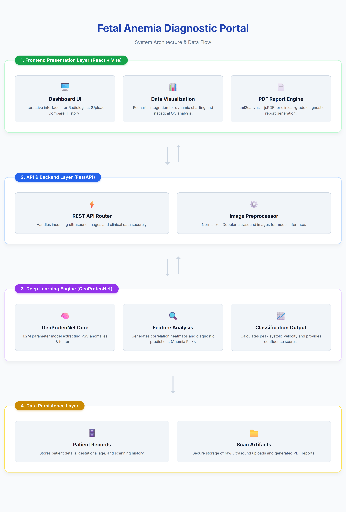

# GeoProteoNet — Fetal Anemia Diagnostic Platform

A full-stack clinical decision-support system that analyzes Doppler ultrasound images to assess fetal anemia risk. Built as a two-stage deep learning pipeline — CNN-based segmentation followed by classical ML classification on extracted hemodynamic features — wrapped in a production-style web application with a FastAPI backend and a React clinical dashboard.

> Final-year B.E. major project, MJCET (2026) — supervised by Ms. Nabeela Fatima.

---

## Overview

Fetal anemia is typically screened using Doppler ultrasound measurements of the Middle Cerebral Artery (MCA), particularly Peak Systolic Velocity (PSV). Manual measurement is time-consuming and operator-dependent. GeoProteoNet automates this by:

1. **Segmenting** the relevant vascular structures from Doppler ultrasound images using a CNN encoder-decoder
2. **Extracting** hemodynamic features (PSV, EDV, RI, PI, S/D Ratio) from the segmented output
3. **Classifying** anemia risk using a Random Forest model trained on those features
4. **Presenting** results through a clinical dashboard with waveform plots, correlation heatmaps, and exportable PDF reports

## Architecture



The system is organized into four layers:

| Layer | Description |
|---|---|
| **Frontend** (React + Vite) | Dashboard UI for upload/compare/history, Recharts-based data visualization, PDF report export via `html2canvas` + `jsPDF` |
| **API/Backend** (FastAPI) | REST endpoints for image upload and analysis, Doppler image preprocessing pipeline |
| **Deep Learning Engine** | CNN encoder-decoder for segmentation, feature extraction, Random Forest classification |
| **Data Persistence** | Patient records and scan history storage, raw ultrasound + generated report storage |

## Model Performance

Reported on the held-out test split of the labeled ultrasound dataset:

- **Segmentation (CNN encoder-decoder):** 93.99% Dice Coefficient
- **Classification (Random Forest on hemodynamic features):** 92.90% F1-score

## Tech Stack

**Frontend:** React, Vite, Tailwind CSS, Recharts, Lucide React
**Backend:** Python, FastAPI, Uvicorn
**ML/CV:** TensorFlow/Keras, OpenCV, Scikit-learn
**Infra/DevOps:** Docker, GitHub Actions (CI/CD), AWS (EC2, S3, IAM, VPC)
**Reporting:** jsPDF, html2canvas

## Project Structure

```
├── backend/          # FastAPI app, model inference, DB access
├── frontend/          # React + Vite dashboard
├── notebooks/         # Model development & training notebooks
├── .github/workflows/ # CI/CD pipeline definitions
└── docker/            # Containerization configs
```

## Running Locally

You'll need the backend and frontend running simultaneously.

### Backend
```bash
cd backend
pip install -r requirements.txt
python main.py
```
Runs on `http://localhost:8000`

### Frontend
```bash
cd frontend
npm install
npm run dev
```
Runs on `http://localhost:5173`

Then open `http://localhost:5173` in your browser.

> **Note on local/demo mode:** If the full training dataset isn't present locally, the training scripts fall back to a lightweight dummy-data path so the pipeline (data loading → model → weights → backend integration) can still be verified end-to-end without the full dataset. This is intentional for local development and CI smoke-testing, not a substitute for the actual trained weights used to produce the metrics above.

## CI/CD

GitHub Actions runs on every push to validate the build and (where configured) run integration smoke tests against the FastAPI backend.

## Team

- **Shaikh Mazein Ahmed**
- **Mohammad Owais**
- **Shaik Syed**

Supervised by Ms. Nabeela Fatima, Dept. of CSE, MJCET.

<!-- TODO: add a one-line contribution note per person, e.g. "Mazein — backend, deployment, CI/CD" -->


## License

This project is licensed under the MIT License — see [LICENSE](./LICENSE) for details.
